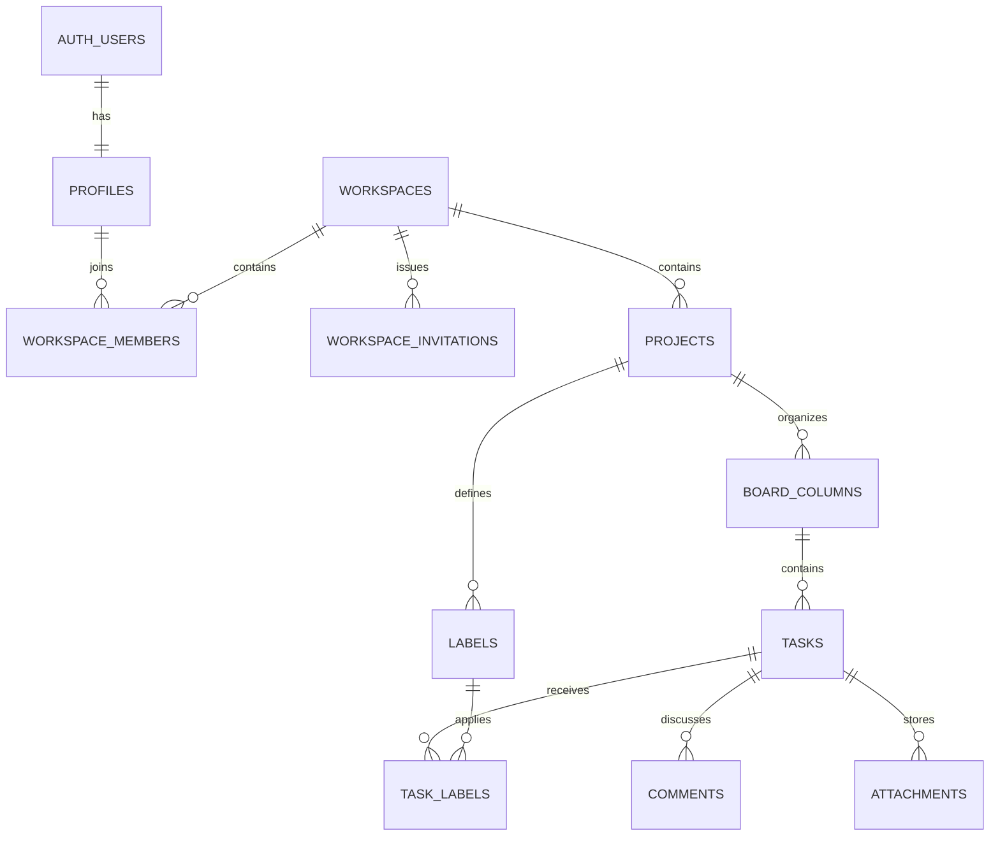

# Database architecture

Relay stores authorization at the workspace boundary. Every product table is protected by PostgreSQL Row Level Security, and workspace-scoped child records carry `workspace_id` with composite foreign keys that prevent cross-workspace relationships.



## Roles

| Capability                             | Owner | Admin | Member |
| -------------------------------------- | ----- | ----- | ------ |
| Read workspace data                    | Yes   | Yes   | Yes    |
| Manage invitations and non-owner roles | Yes   | Yes   | No     |
| Manage workspace settings and projects | Yes   | Yes   | No     |
| Delete workspace                       | Yes   | No    | No     |
| Create and edit tasks and labels       | Yes   | Yes   | Yes    |
| Edit/delete own comments               | Yes   | Yes   | Yes    |
| Change or remove Owner directly        | No    | No    | No     |

Owner transfer is intentionally reserved for a dedicated transactional server flow in the workspace-management stage. Direct table policies cannot create, update, or delete an existing Owner membership.

## Security model

- `private` contains security-definer membership helpers and is not exposed by PostgREST.
- `anon` has no privileges on application tables.
- `authenticated` receives only the table operations required by the product rules; RLS further restricts rows.
- `service_role` remains server-only and bypasses RLS for tightly scoped administrative workflows.
- Projects and tasks archive instead of exposing hard-delete operations.
- Task assignees are constrained to members of the same workspace.
- Task, label, comment, and attachment relationships use composite keys to prevent cross-project or cross-workspace references.
- `complete_onboarding` validates the authenticated user and creates the profile update, first workspace, and Owner membership atomically. Repeated submissions return the existing workspace instead of creating duplicates.

## Verification

`supabase/tests/database` contains pgTAP schema and RLS tests for Owner, Admin, Member, outsider, and anonymous access. Run the complete database gate with:

```bash
pnpm db:start
pnpm db:verify
```

Regenerate checked-in database types after every schema change:

```bash
pnpm db:types
```
